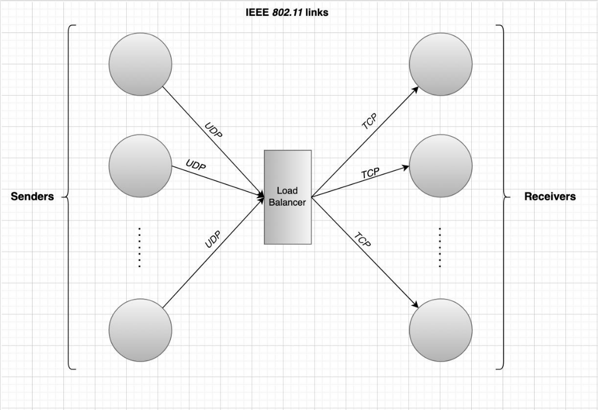

# NS3 Project - Load Balancer and Sender-Receiver Nodes

## Introduction
This project implements a simulation of a load balancer and sender-receiver nodes in the ns-3 network simulator. The sender nodes send data using the User Datagram Protocol (UDP) to the load balancer, which then distributes the data to a randomly selected receiver node using the Transmission Control Protocol (TCP).
The Topology of the network can be seen bellow  


## Implementation
For this topology we first create three sender node and three receivers and one load balancer  
Then we build a custom application `LoadBalander` that inherits from `Application` class and is just a simple application that gets packet in udp and sends them to a random node with tcp protocol.  
The Load balancer application is in two files named `load-balancer.h` and `load-balancer.cc`.  
Then for senders application we use prebuilt application `UdpEchoClientHelper` and configure that so every 0.0001 seconds all senders node send 1024 byte data to load balancer.  
For Receiver application we use prebuilt `PacketSinkHelper` application this class is a simple application that just get message in tcp and sink them.  
Then we run the simulaiton for 10 seconds with bandwidth of 1 Mbps and no error rate and get a thoughput of `0.79` Mbps. 

 
## Requirements
* ns-3
* C++11 compiler

## Project Structure
* src: contains the source code for the project
* results: contains the output files generated by the simulation

## How to Run
1. Navigate to the project directory in a terminal.
2.  Compile the project using the following command:
```
./waf configure --enable-examples
./waf build
```
3. Run the simulation using the following command:
```
./waf --run "topology --eror=<error_rate> --bandWidth=<band_width>"
```
4. The simulation output will be generated in the results directory.

## Results  
The output of the throughput function can be seen bellow
```
Flow ID			: 1 ; 10.1.1.1 -----> 10.1.1.5
Tx Packets = 2
Rx Packets = 2
Duration		: 1.08871
Last Received Packet	: 1.08871 Seconds
Throughput: 0.000756834 Mbps
---------------------------------------------------------------------------
Flow ID			: 2 ; 10.1.1.1 -----> 10.1.1.6
Tx Packets = 2
Rx Packets = 2
Duration		: 1.00721
Last Received Packet	: 1.00721 Seconds
Throughput: 0.000818076 Mbps
---------------------------------------------------------------------------
Flow ID			: 3 ; 10.1.1.1 -----> 10.1.1.7
Tx Packets = 2
Rx Packets = 2
Duration		: 1.06647
Last Received Packet	: 1.06647 Seconds
Throughput: 0.000772619 Mbps
---------------------------------------------------------------------------
Flow ID			: 4 ; 10.1.1.2 -----> 10.1.1.1
Tx Packets = 100000
Rx Packets = 0
Duration		: 0
Last Received Packet	: 0 Seconds
Throughput: -nan Mbps
---------------------------------------------------------------------------
Flow ID			: 5 ; 10.1.1.3 -----> 10.1.1.1
Tx Packets = 100000
Rx Packets = 5174
Duration		: 9.99699
Last Received Packet	: 9.99699 Seconds
Throughput: 4.15396 Mbps
---------------------------------------------------------------------------
Flow ID			: 6 ; 10.1.1.4 -----> 10.1.1.1
Tx Packets = 100000
Rx Packets = 5114
Duration		: 9.99993
Last Received Packet	: 9.99993 Seconds
Throughput: 4.10459 Mbps
---------------------------------------------------------------------------
Flow ID			: 7 ; 10.1.1.7 -----> 10.1.1.1
Tx Packets = 760
Rx Packets = 760
Duration		: 8.92494
Last Received Packet	: 9.92794 Seconds
Throughput: 0.0422804 Mbps
---------------------------------------------------------------------------
Flow ID			: 8 ; 10.1.1.6 -----> 10.1.1.1
Tx Packets = 1402
Rx Packets = 1402
Duration		: 8.98265
Last Received Packet	: 9.98595 Seconds
Throughput: 0.072694 Mbps
---------------------------------------------------------------------------
Flow ID			: 9 ; 10.1.1.5 -----> 10.1.1.1
Tx Packets = 448
Rx Packets = 447
Duration		: 8.99249
Last Received Packet	: 9.99662 Seconds
Throughput: 0.0245498 Mbps
---------------------------------------------------------------------------
```

## Configuration
You can modify the number of sender and receiver nodes, the data rate, and other parameters in the source code in src/load-balancer-sender-receiver.cc.

## Conclusion
This project demonstrates a basic implementation of a load balancer and sender-receiver nodes in ns-3. It can be used as a starting point for more complex simulations and as a reference for using ns-3.